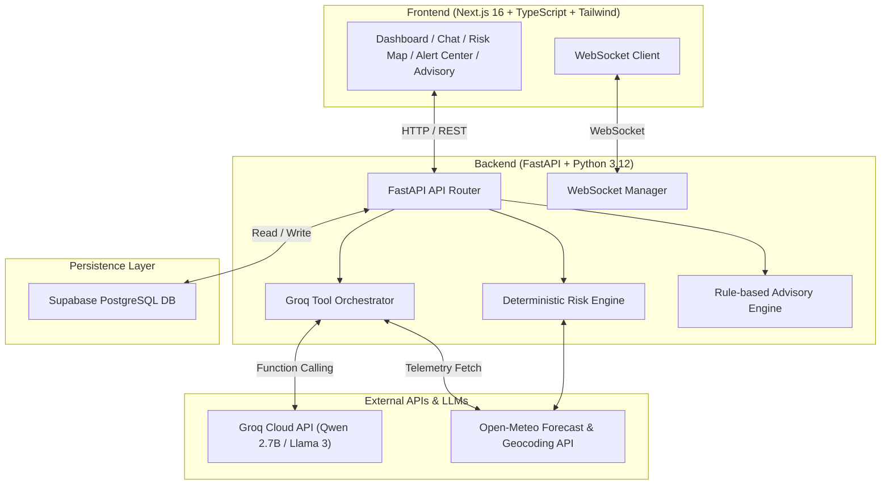

# 🌤️ WeatherGPT — AI-Powered Weather Intelligence & Early-Warning Platform

> **WeatherGPT** is a production-grade, end-to-end weather intelligence application combining real-time meteorological telemetry, deterministic hazard risk assessment, persona-based advisories, and a multilingual AI conversational assistant (English, Hindi, Hinglish).

---

## 📌 Table of Contents

- [Overview](#-overview)
- [Key Features](#-key-features)
- [System Architecture](#-system-architecture)
- [Tech Stack](#-tech-stack)
- [Project Structure](#-project-structure)
- [Database Schema (Supabase PostgreSQL)](#-database-schema-supabase-postgresql)
- [Environment Variables](#-environment-variables)
- [Local Setup & Installation](#-local-setup--installation)
  - [1. Backend Setup (FastAPI + Python)](#1-backend-setup-fastapi--python)
  - [2. Frontend Setup (Next.js + Tailwind)](#2-frontend-setup-nextjs--tailwind)
- [API Reference](#-api-reference)
- [Multilingual & Grounding Demonstration](#-multilingual--grounding-demonstration)
- [Deployment Guide](#-deployment-guide)
- [License](#-license)

---

## 🌤️ Overview

WeatherGPT addresses the gap between raw, complex meteorological data and actionable human decisions. Instead of presenting confusing pressure graphs or technical indexes, WeatherGPT:
1. **Fetches Real-Time Data** from Open-Meteo API with an in-memory & Supabase PostgreSQL cache layer.
2. **Evaluates Deterministic Risk** across rainfall severity, wind gusts, heat index, and active official warnings.
3. **Generates Persona Advisories** tailored specifically for citizens, farmers, and heat safety.
4. **Delivers AI Conversations** using Groq LLMs grounded strictly in audited weather data (no hallucinations) with full support for **English**, **Devanagari Hindi**, and **Latin-script Hinglish**.

---

## ✨ Key Features

### 1. 📊 Interactive Weather Dashboard
- Real-time temperature, apparent ("feels like") temperature, humidity, precipitation, wind speed, and cloud cover.
- 7-Day daily forecast with high/low temperatures and precipitation probability.
- Dynamic location search using Open-Meteo Geocoding API.
- Active warning banners with direct deep-links to emergency alerts.

### 2. 🤖 Grounded AI Chat Assistant (WeatherGPT)
- Tool-calling agent powered by Groq LLMs (`qwen/qwen3.6-27b`).
- **Zero Hallucination Policy**: Every answer is strictly grounded in data queried via functions (`get_weather`, `get_risk_score`, `get_advisory`, `get_active_alerts`).
- **Multilingual Engine**: Native support for English, Hindi (हिंदी), and Hinglish (e.g., *"Kal pesticide spray kar sakta hoon in Noida?"*).
- **Auditability**: Expandable *"Source Data Used"* section showing exact tool calls made and raw JSON data utilized for response generation.

### 3. 🗺️ Early-Warning Risk Map
- Interactive Leaflet map displaying hazard levels for queried coordinates.
- **Composite Risk Index (0–100)** calculated using weighted sub-scores:
  - 🌧️ **Rainfall Hazard** (Accumulated rainfall vs. thresholds)
  - 💨 **Wind Hazard** (Sustained speed & max gust thresholds)
  - 🌡️ **Temperature & Heat Risk** (Heat index & apparent temperature thresholds)
  - 🚨 **Official Warning Severity** (Emergency alerts in effect)
- Human-readable driver factors explaining the exact mathematical threshold triggers.

### 4. 🚨 Real-Time Alert Center (WebSockets)
- Instant push notifications for emergency weather events over WebSocket connections (`/ws/alerts`).
- Categorized severity levels (Extreme, Severe, Moderate, Minor) with affected locations and actionable instructions.

### 5. 📋 Persona-Based Advisory Panel
- Rule-based operational guidance filtered by persona:
  - 🏙️ **Citizen & Travel Safety** (Commute hazards, hydration, outdoor safety)
  - 🌾 **Farmer & Agricultural** (Irrigation planning, pesticide/fertilizer spraying windows, crop vulnerability)
  - ☀️ **Heat Wave & Health** (Direct sun exposure, heat stroke precautions)

---

## 🏗️ System Architecture



---

## 💻 Tech Stack

### Backend
- **Framework**: FastAPI (Python 3.12)
- **AI / LLM**: Groq Cloud API (`qwen/qwen3.6-27b`)
- **Database & Cache**: Supabase PostgreSQL (`supabase-py`), Async In-Memory Cache
- **Data Validation**: Pydantic v2
- **Realtime**: WebSockets (`starlette.websockets`)
- **Telemetry Provider**: Open-Meteo Weather & Geocoding API

### Frontend
- **Framework**: Next.js 16 (App Router, Turbopack)
- **Language**: TypeScript
- **Styling**: Tailwind CSS v4
- **Mapping**: Leaflet + React-Leaflet
- **Markdown Rendering**: React-Markdown
- **Icons & UI**: Lucide-React / Custom Glassmorphism System

---

## 📁 Project Structure

```
WeatherGPT/
├── backend/
│   ├── app/
│   │   ├── api/
│   │   │   └── routes/         # Feature routes (chat, weather, risk, alerts, location, websocket)
│   │   ├── core/               # App configuration & environment settings
│   │   ├── db/                 # Supabase client initialization
│   │   ├── schemas/            # Pydantic request/response schemas
│   │   └── services/           # Business logic (Groq service, risk engine, advisory engine, cache)
│   ├── tests/                  # Pytest backend test suite
│   ├── .env                    # Backend environment variables
│   ├── requirements.txt        # Python dependencies
│   └── main.py                 # FastAPI application entrypoint
│
├── frontend/
│   ├── app/
│   │   ├── advisory/           # Persona advisory panel (/advisory)
│   │   ├── alerts/             # Emergency Alert Center (/alerts)
│   │   ├── chat/               # Multilingual AI Chat interface (/chat)
│   │   ├── risk/               # Interactive Early-Warning Risk Map (/risk)
│   │   ├── layout.tsx          # Root layout with navigation bar
│   │   └── page.tsx            # Home Weather Dashboard (/)
│   ├── components/             # Reusable UI components & Client Leaflet Map
│   ├── lib/                    # API client wrapper & TypeScript interfaces
│   ├── public/                 # Static assets
│   ├── .env.local              # Frontend environment variables
│   └── package.json            # Node.js dependencies & build scripts
│
├── supabase/
│   └── migrations/             # SQL schema migrations for Supabase PostgreSQL
└── README.md                   # End-to-end documentation
```

---

## 🗄️ Database Schema (Supabase PostgreSQL)

The database schema is defined in `supabase/migrations/20260824000000_initial_schema.sql` and includes the following tables:

1. **`users`**: User profiles, preferences (`preferred_language`, `use_case`).
2. **`locations`**: Saved user locations with latitude/longitude coordinates.
3. **`weather_cache`**: Cached weather responses indexed by `(lat, lon)` with expiry timestamps.
4. **`alerts`**: Active weather warnings, issue/expiry times, severity, and safety instructions.
5. **`chat_sessions`**: Conversation sessions tied to users.
6. **`chat_messages`**: Message history with roles (`user`, `assistant`) and metadata.
7. **`advisories`**: Historical advisories generated by the engine.

---

## 🔑 Environment Variables

### Backend (`backend/.env`)
```ini
SUPABASE_URL=https://your-supabase-project.supabase.co
SUPABASE_KEY=your-supabase-anon-or-service-role-key
GROQ_API_KEY=gsk_your_groq_api_key
GROQ_MODEL=qwen/qwen3.6-27b
ENVIRONMENT=development
```

### Frontend (`frontend/.env.local`)
```ini
NEXT_PUBLIC_API_URL=http://localhost:8000
NEXT_PUBLIC_WS_URL=ws://localhost:8000
```
> **Production Note**: Set `NEXT_PUBLIC_API_URL` to your deployed backend URL (e.g. `https://weather-gpt-backend.onrender.com`).

---

## 🛠️ Local Setup & Installation

### Prerequisites
- **Python**: `3.10+` (Python 3.12 recommended)
- **Node.js**: `18.0+` (Node 20+ recommended)
- **Git**

---

### 1. Backend Setup (FastAPI + Python)

1. Navigate to the backend directory:
   ```bash
   cd backend
   ```

2. Create and activate a Python virtual environment:
   - **Windows**:
     ```powershell
     python -m venv ..\.venv
     ..\.venv\Scripts\Activate.ps1
     ```
   - **macOS / Linux**:
     ```bash
     python3 -m venv ../.venv
     source ../.venv/bin/activate
     ```

3. Install required Python packages:
   ```bash
   pip install -r requirements.txt
   ```

4. Create a `.env` file inside `backend/` and configure your API keys (Groq & Supabase).

5. Start the FastAPI development server:
   ```bash
   python -m uvicorn app.main:app --reload --port 8000
   ```
   The backend will be live at `http://localhost:8000`. You can inspect interactive OpenAPI docs at `http://localhost:8000/docs`.

---

### 2. Frontend Setup (Next.js + Tailwind)

1. Navigate to the frontend directory:
   ```bash
   cd frontend
   ```

2. Install Node.js dependencies:
   ```bash
   npm install
   ```

3. Create `.env.local` inside `frontend/`:
   ```ini
   NEXT_PUBLIC_API_URL=http://localhost:8000
   NEXT_PUBLIC_WS_URL=ws://localhost:8000
   ```

4. Run the Next.js development server:
   ```bash
   npm run dev
   ```
   The frontend will be live at `http://localhost:3000`.

---

## 📡 API Reference

| Method | Endpoint | Description |
| :--- | :--- | :--- |
| `GET` | `/health` | Server health check |
| `GET` | `/api/weather` | Current weather & 7-day forecast (`?lat=...&lon=...`) |
| `GET` | `/api/location/search` | Geocoding search (`?q=Noida&count=5`) |
| `POST` | `/api/chat` | Multilingual AI weather question answering |
| `GET` | `/api/risk` | Deterministic hazard risk score & driver breakdown (`?lat=...&lon=...`) |
| `GET` | `/api/alerts` | Active meteorological warning alerts (`?lat=...&lon=...`) |
| `WS` | `/ws/alerts` | Real-time emergency warning WebSocket stream |

---

## 🗣️ Multilingual & Grounding Demonstration

WeatherGPT handles queries seamlessly in English, Hindi, and Hinglish while grounding answers strictly in real Open-Meteo telemetry data.

### Example Prompt (Hinglish):
> *"Kal pesticide spray kar sakta hoon Noida me?"*

### Response (Grounded Hinglish Output):
> *"Noida me kal moderate rain expected hai (approx 5.2mm) aur wind speed 29 km/h tak ja sakti hai. Is wajah se kal pesticide spray karna advisable nahi hai kyunki rain spray ko wash off kar degi aur high wind drift cause karegi. Behtar hoga ki aap weather clear hone ka wait karein."*

---

## 🚀 Deployment Guide

### Deploying Frontend on Vercel
1. Push your repository to GitHub.
2. Import project into Vercel and set Root Directory to `frontend`.
3. Add Environment Variable:
   - `NEXT_PUBLIC_API_URL` = `https://your-backend-domain.com`
4. Deploy!

### Deploying Backend on Render / Railway / Docker
1. Root directory: `backend`.
2. Build Command: `pip install -r requirements.txt`.
3. Start Command: `uvicorn app.main:app --host 0.0.0.0 --port 8000`.
4. Set environment variables (`GROQ_API_KEY`, `SUPABASE_URL`, `SUPABASE_KEY`).

---

## 📄 License

Distributed under the MIT License. See `LICENSE` for more information.

---

<p center>
  Built with ❤️ for AI-Powered Climate & Agriculture Intelligence.
</p>
